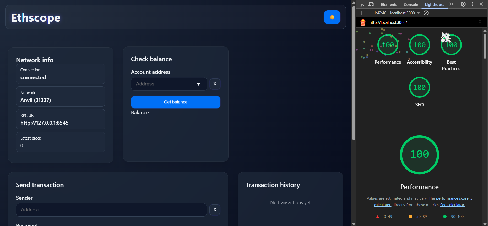
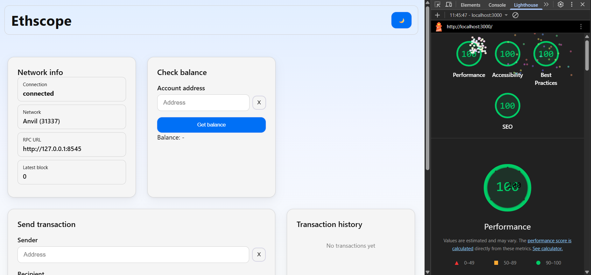
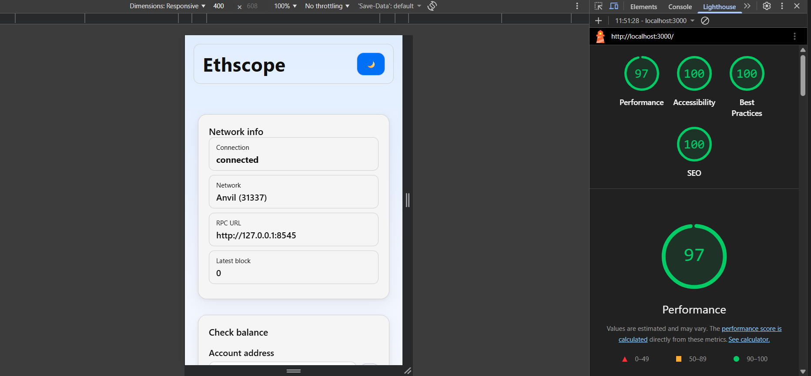
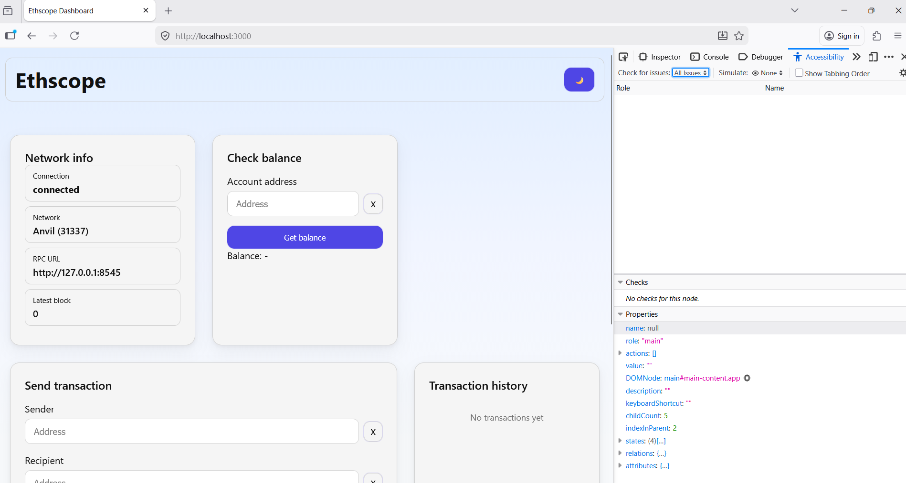
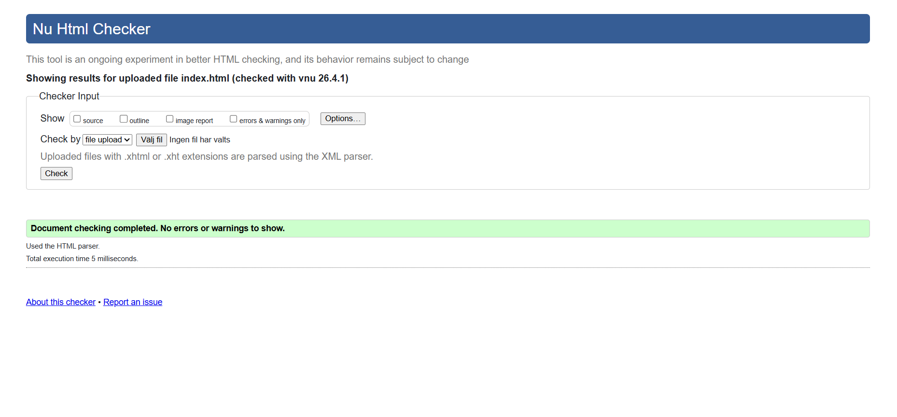

# Ethscope


Ethscope is a lightweight Ethereum dashboard built with JavaScript that connects to a local blockchain using Anvil.
The application allows users to inspect network data, check account balances and send transactions in a simple and structured UI.

---

## Overview

This project demonstrates how to consume a blockchain using JavaScript.
The application connects to a local Ethereum node and interacts with it through ethers.js.

Focus areas of the project:

* blockchain interaction
* clean frontend structure
* validation and error handling
* testing and debugging

---

## Features

* Connect to a local Ethereum network (Anvil)
* Display network information (connection, chain id, RPC, latest block)
* Check account balances
* Send transactions between accounts
* View transaction history
* Status logging system
* Dark mode toggle
* Accessible UI (labels, focus states, skip link)

---

## Tech Stack

* JavaScript (ES Modules)
* Ethers.js
* Anvil (local blockchain)
* HTML5 (semantic structure)
* CSS (custom styling + dark mode)

---

## Getting Started

### 1. Install dependencies

```bash
npm install
```

---

### 2. Start Anvil (local blockchain)

```bash
anvil
```

Default RPC:

```
http://127.0.0.1:8545
```

---

### 3. Start the application

```bash
npx serve client
```

Then open in browser:

```
http://localhost:3000
```

---

## Project Structure

```
ethscope/
│
├── client/
│   ├── css/
│   │   └── main.css
│   ├── js/
│   │   └── main.js
│   └── index.html
│
├── lib/
│   ├── api.js
│   ├── ethereum.js
│   └── validation.js
│
├── tests/
│   ├── app.test.js
│   ├── integration.basic.test.js
│   └── transaction.basic.test.js
│
├── assets/
│   └── (screenshots & banner)
│
├── package.json
└── README.md
```

---

## Testing

The project includes automated tests using Node’s built-in test runner.

Run all tests:

```bash
npm test
```

Or directly:

```bash
node --test tests/*.test.js
```

---

### Test Coverage

The tests focus on:

* address validation
* amount validation
* edge cases (invalid input, formatting)
* transaction input validation
* basic integration flow

Example test cases:

* valid / invalid Ethereum addresses
* zero and negative amounts
* text input instead of numbers
* incorrect address length

---

## Accessibility & Quality

The application has been tested for accessibility and performance.

### Lighthouse 

Dark mode

---
Light mode

---
Mobile 



---

### Mozilla Accessibility (a11y)




---

### HTML Validation

 


---

## Notes

* The application runs entirely on a local blockchain (Anvil)
* No external wallet is required
* Designed to demonstrate real blockchain interaction using JavaScript
* Focus on clean structure, testing and usability

---

## Author

Ethscope – 2026
